# Claude Code Agent-Based Development Template

An experimental template for spec-driven development using Claude Code's agent system, inspired by AWS Kiro's specification-first approach.

# AI System Architecture

## Development Workflow Architecture

### Phase 1: Sequential Specification Creation


### Continuous Architecture Validation

```mermaid
sequenceDiagram
    participant DEV as developer-agent
    participant ARCH as architecture-agent (GUARDIAN)
    participant GUIDE as architectural-guidelines.md
    participant DESIGN as design.md
    
    Note over DEV,ARCH: Continuous Consultation Model
    
    DEV->>ARCH: "How should I implement PCAPAnalyzer service?"
    ARCH->>GUIDE: Load clean architecture patterns
    ARCH->>DESIGN: Check dependency injection design
    ARCH->>DEV: "Follow service layer pattern with adapter injection"
    
    DEV->>DEV: Implements PCAPAnalyzer with adapters
    DEV->>ARCH: "Please validate service implementation"
    ARCH->>GUIDE: Check against hexagonal architecture
    ARCH->>ARCH: Validate adapter pattern compliance
    ARCH->>DEV: "✅ Clean architecture compliant" or "❌ Needs DI adjustment"
    
    DEV->>ARCH: "Best practice for error handling in services?"
    ARCH->>GUIDE: Load error handling standards
    ARCH->>DEV: "Use result pattern with graceful degradation"
```



### Context-Driven Development Flow


## Key Principles

### Sequential Specification Creation
1. **product-owner-agent** - Analyzes business requirements and user needs
2. **design-agent** - Creates system architecture following clean architecture principles  
3. **tasks-agent** - Breaks down design into implementable development tasks

### Architecture Guardian Pattern
- **architecture-agent** acts as continuous guardian of architectural integrity
- Validates each specification phase against architectural guidelines
- Provides real-time guidance during development
- Ensures clean architecture principles are maintained

### Context-Driven Development
- All agents work with complete context from generated specifications
- Development follows the established design and task breakdown
- Continuous validation ensures architectural compliance
- Standards are enforced through foundational guideline documents

## (optional) Implementation Commands

### Specification Phase
```bash
/dev-workflow pcap-to-plantuml
# Triggers sequential: product-owner → design-agent → tasks-agent
```

### Development Phase  
```bash
/develop "implement PCAPAnalyzer service with adapter pattern"
/architecture-review src/core/services/
/code-review src/core/models/
```

### Architectural Consultation
```bash
/architecture-consult "How to handle ML adapter dependencies?"
```

This architecture ensures clean separation of concerns, maintains architectural integrity, and provides a structured approach to AI-assisted development that scales with project complexity.

## Overview

This template provides a structured approach to software development using specialized Claude Code agents that work together to create comprehensive specifications before implementation. Each agent has a defined role and outputs to specific directories within `.claude/specs/`.

## Key Features

- **Spec-Driven Development**: Create detailed specifications before coding
- **Agent Specialization**: Four specialized agents with distinct roles and responsibilities
- **Visual Documentation**: Design agent creates data flow and architectural diagrams
- **Structured Templates**: Consistent documentation formats across all specifications
- **Collaborative Workflow**: Agents build upon each other's work for comprehensive planning

## Agent Roles

### 🎯 Product Owner Agent
- **Focus**: Business requirements and user stories
- **Output**: `.claude/specs/business/`
- **Deliverables**: Product specifications, user stories, acceptance criteria

### 🏗️ Design Agent
- **Focus**: System architecture with visual diagrams
- **Output**: `.claude/specs/architecture/`
- **Deliverables**: Data flow diagrams, class diagrams, technical architecture
- **Special Feature**: Creates Mermaid diagrams for visual system understanding

### 👨‍💻 Developer Agent  
- **Focus**: Technical implementation details
- **Output**: `.claude/specs/implementation/`
- **Deliverables**: Code structure, patterns, technical requirements

### 📋 Tasks Agent
- **Focus**: Project management and workflows
- **Output**: `.claude/specs/workflows/`
- **Deliverables**: Task breakdowns, development processes, quality gates

## Getting Started

1. **Initialize**: Use this template as your starting point
2. **Engage Product Owner**: Start with business requirements
3. **Design Architecture**: Create system design with diagrams
4. **Plan Implementation**: Define technical specifications
5. **Create Workflow**: Break down into actionable tasks
6. **Iterate**: Refine specifications based on discoveries

## Directory Structure

```
.claude/
├── specs/
│   ├── business/          # Product specifications
│   ├── architecture/      # System design & diagrams
│   ├── implementation/    # Technical specifications
│   └── workflows/         # Development processes
└── [other claude config files]
```

## Experimental Goals

This template is designed to explore:

- **Role Definition Effectiveness**: How well-defined agent roles improve output quality
- **Template-Driven Consistency**: Impact of structured templates on specification quality
- **Context Management**: Better ways for agents to share and build upon work
- **Adaptive Context Loading**: Dynamic context loading based on task requirements

## Future Research Areas

- Cross-agent context sharing mechanisms
- Template evolution for different project types
- Automated specification validation
- Integration with development tools and CI/CD workflows
- Metrics for measuring specification completeness and quality

## Usage Notes

- Start each project by engaging the Product Owner agent first
- Ensure the Design agent creates visual diagrams (data flow, class/component diagrams)
- Use the structured templates provided in CLAUDE.md
- Iterate and refine specifications as the project evolves
- Document learnings and improvements for template evolution

---

*This is an experimental template for testing agent-based spec-driven development. Contributions and feedback on role definitions, templates, and workflow improvements are welcome.*